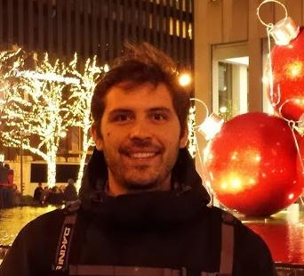

I am applying machine learning to the challenges associated with Space Situational Awareness (SSA) ranging from sensor fusion to collision avoidance and optimal maneuvers. I build machine learning models that tackle various practical challenges. I am in the learning curve of deploying optimized machine learning models for Low-SWaP devices.
